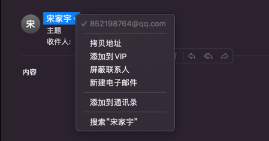
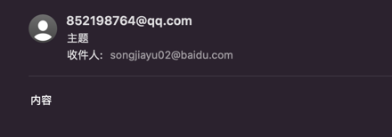

# 前言
使用Go发送邮件，目前官网GO 1.17的版本的文档中，包 "net/smtp" 仅支持支持两种SMTP的认证方式。CRAM-MD5和PLAIN 认证方式。但是目前smtp的认证方式有非常多包括：GSSAPI、NTLM、LOGIN、Kerberos、XOAUTH、XOAUTH2。以下为一些认证方式介绍：
* CRAM-MD5： 是基于Keyed-MD5的认证方式
* PLAIN: 是一种明文的验证方式
* LOGIN: 邮箱登录的方式，使用邮箱的账号和密码

公司使用的邮件服务器SMTP支持三种认证方式：GSSAPI、NTLM、LOGIN。

# 认证方式
1. 在原来的CRAM-MD5和PLAIN的基础上增加了LOGIN方式
2. 通过**helo**接口自动化认证方式
```go
if ok, authStr := c.Extension("AUTH"); ok {
    var a smtp.Auth
    if strings.Contains(authStr, "PLAIN") && authType == PlainAuthType {
        a = smtp.PlainAuth("", from, password, host)
    } else if strings.Contains(authStr, "LOGIN") && authType == LoginAuthType {
        a = NewLoginAuth(from, password)
    } else if strings.Contains(authStr, "") && authType == CramMd5AuthType {
        a = smtp.CRAMMD5Auth(from, password)
    } else {
        log.Errorf("dont support this authType: %s", authType)
        return fmt.Errorf("dont support this authType: %s", authType)
    }
    if err = c.Auth(a); err != nil {
        log.Error("check auth with err:", err)
        return err
    }
}
```


## 参数介绍
```go
type Email struct {
    From      string   // 发件人邮箱，如：songjiayu02@baidu.com
    FromAlias string   // 发件人别名（选填），如：宋家宇
    Password  string   // 发件人邮箱密码
    AuthType  string   // smtp认证方式，默认PLAIN
    Addr      string   // 邮箱地址(一般端口为25)，如：email.baidu.com:25
    To        []string // 收件人邮箱
    Subject   string   // 主题
    Body      string   // 内容
}
```
## FromAlias
区别在于发件人的别名：如果设置如图1，不设置如图2
* 图1  
  
  
* 图2  

  
## AuthType
仅支持constant.go文件里面的认证方式

# 示例
[示例参考](https://console.cloud.baidu-int.com/devops/icode/repos/baidu/det-drd/det-go-sdk/tree/master:example/email_example)