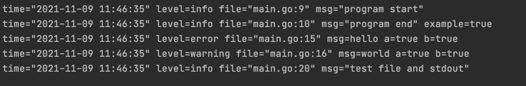

# 日志SDK
## 默认初始化
1. 默认输出到stdout, 使用 **SetOutpu** 修改输出位置
2. 默认输出类型日志类型为json , 使用 **SetFormatter(log.TextFormat)** 修改输出格式为text
3. 默认显示日志级别为INFO，使用 **SetLevel** 修改日志显示级别
4. 默认输出字段为 *file*, *level*, *msg*, *time*

## 使用With类语法为日志添加字段
1. **With**, **WithFields** 添加多个字段
2. **WithField** 添加一个字段
3. **WithError** , **WithContext** , **WithTime** 分别添加Error, Context, Time

## 输出样式

## 实例
[example](https://console.cloud.baidu-int.com/devops/icode/repos/baidu/det-drd/det-go-sdk/tree/master:example/log_example)
